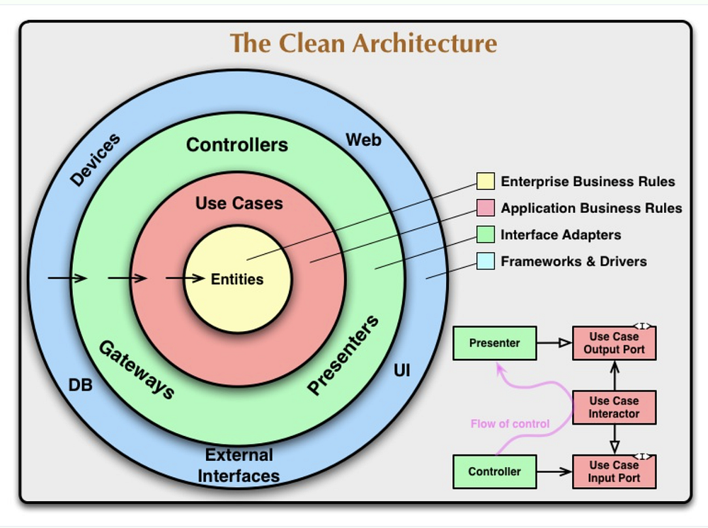

поетру настройки для установки в папку проекта и пр спецефичное:
https://python-poetry.org/docs/configuration/

poetry установил в дефолтный кэш /.cache/pypoetry/virtualenvs

-----------------------------

https://youtu.be/qBMjLr0rC4E?t=260
Чистая архетектура:

- Зависимости 3->2->1->0 . 0->1 зависимость не допустима ( пример разделения чистой архетектуры: мы должны написать модели так, что бы они не зависили от орм)
- иногда в жерту приходит DRY
- например в джанго нужен доп бизнес слой, а не логика во вьюхах, но логика доуступа к данным сломается, т.к в джанго это уже приклеено клеем

1) сущности - модели(но не джанговские)
2) сценарии
3) интерфейсы-адаптеры
4) фреймворки и драйверы

------------------
работаем через тдд и чистую архитектуру
1- создаем сущности()

--------------
DRY - принцип надежности, за счёт того, что в случае необходимости измиенений в меньшем кол-ве уменьшается вероятность ошибки
У DRY есть конфликты в некоторых моментах с `чистой архетектурой` 
за счёт дублирования кода в некоторых моментах => чистая архетекутра провоцирует ошибки

----------------
в джанго не асинхронное:
orm
middleware

тип сорт:
в питоне реализован лгоритм сортировки, который быстрее чем быстрая сортировка

